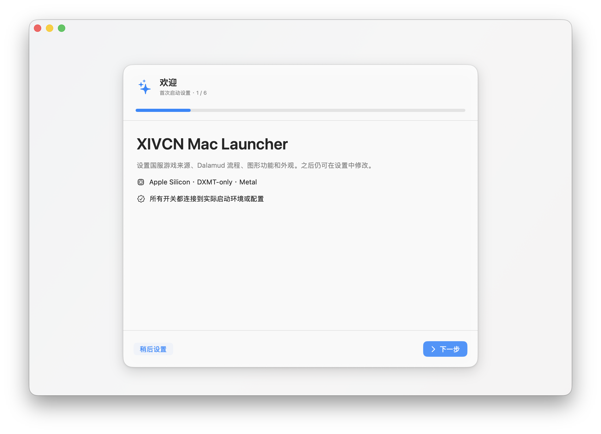
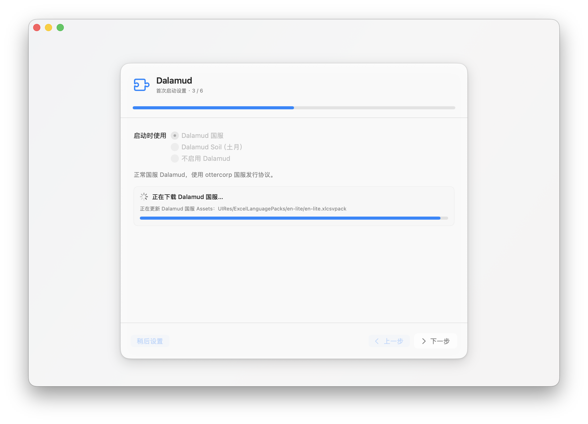
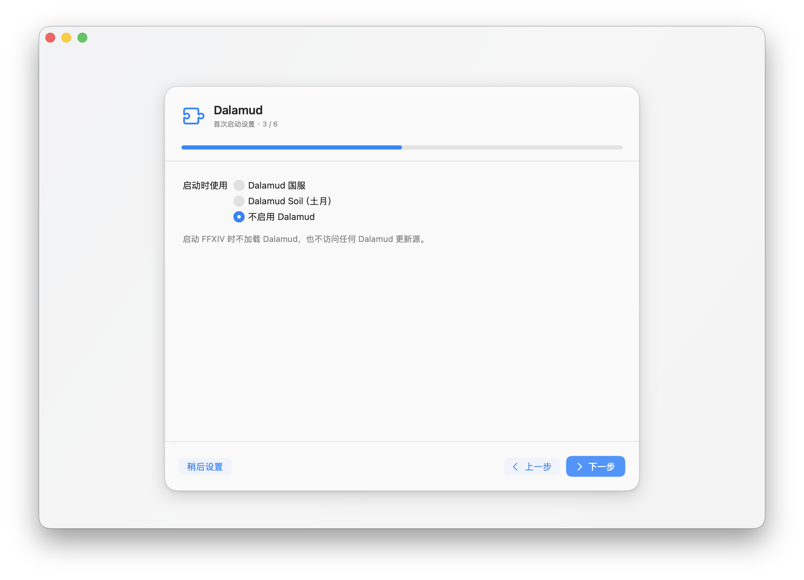
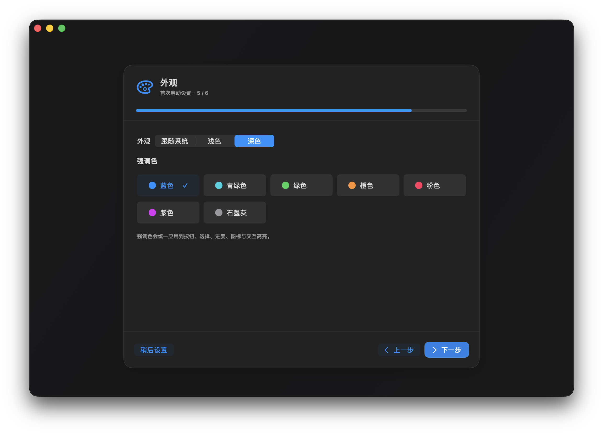
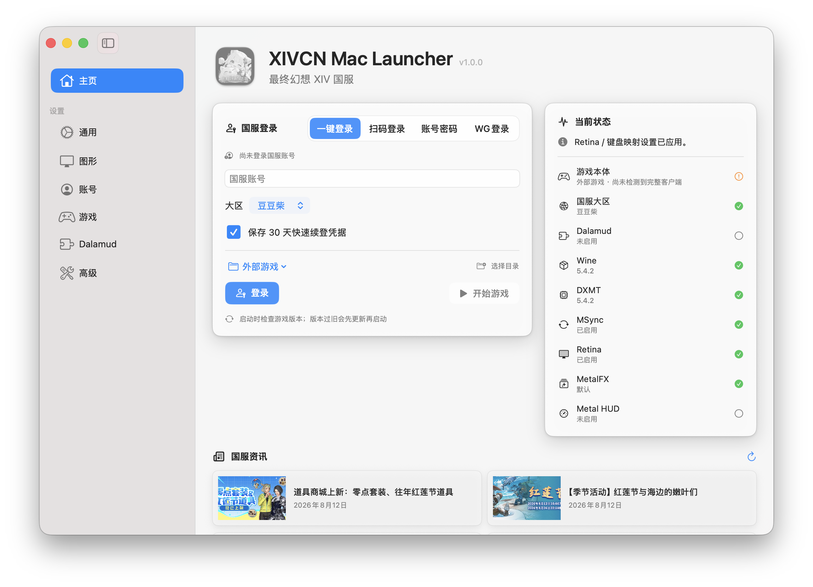
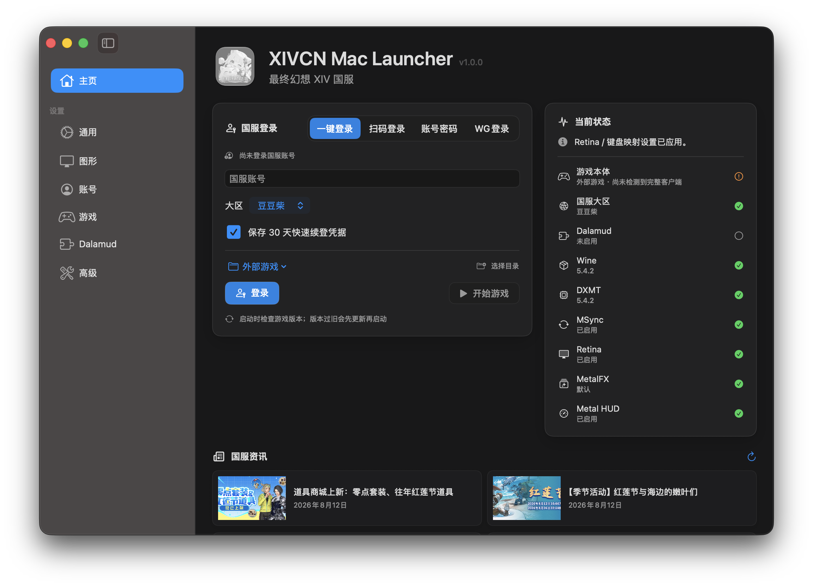
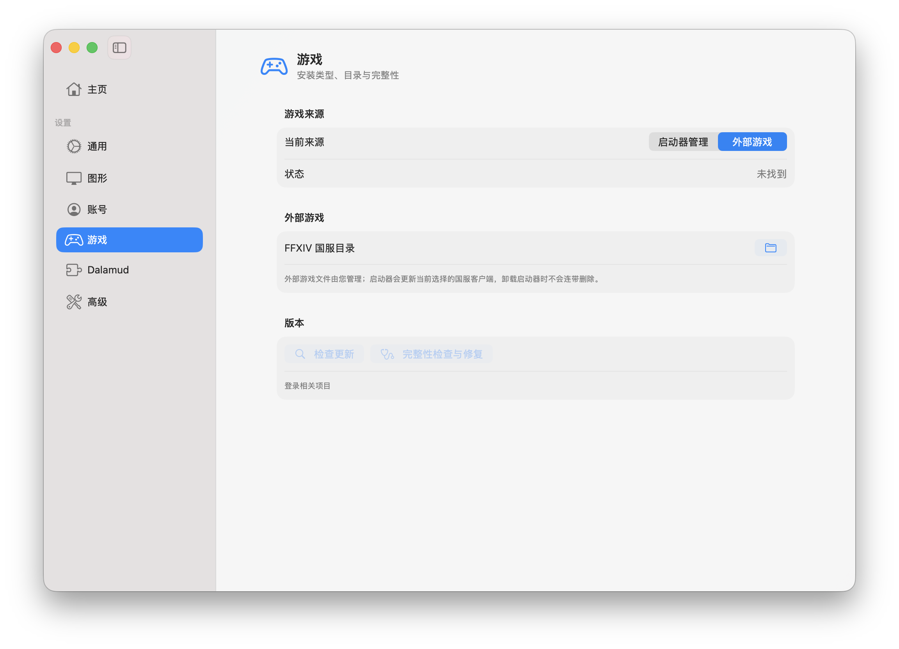
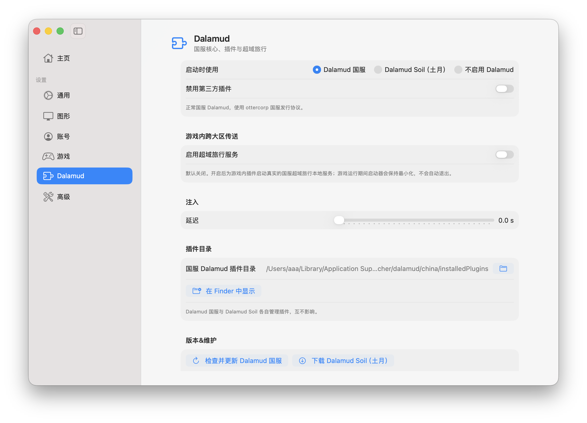
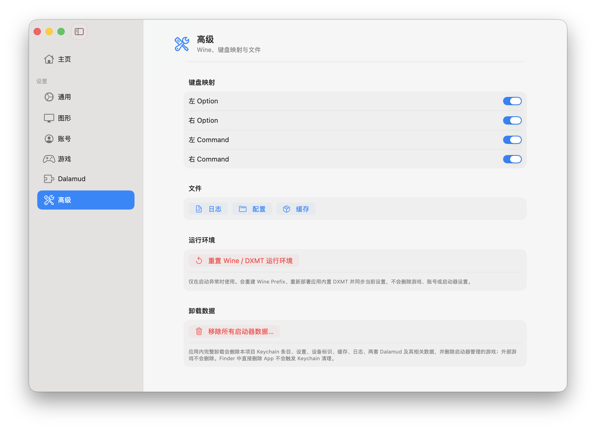
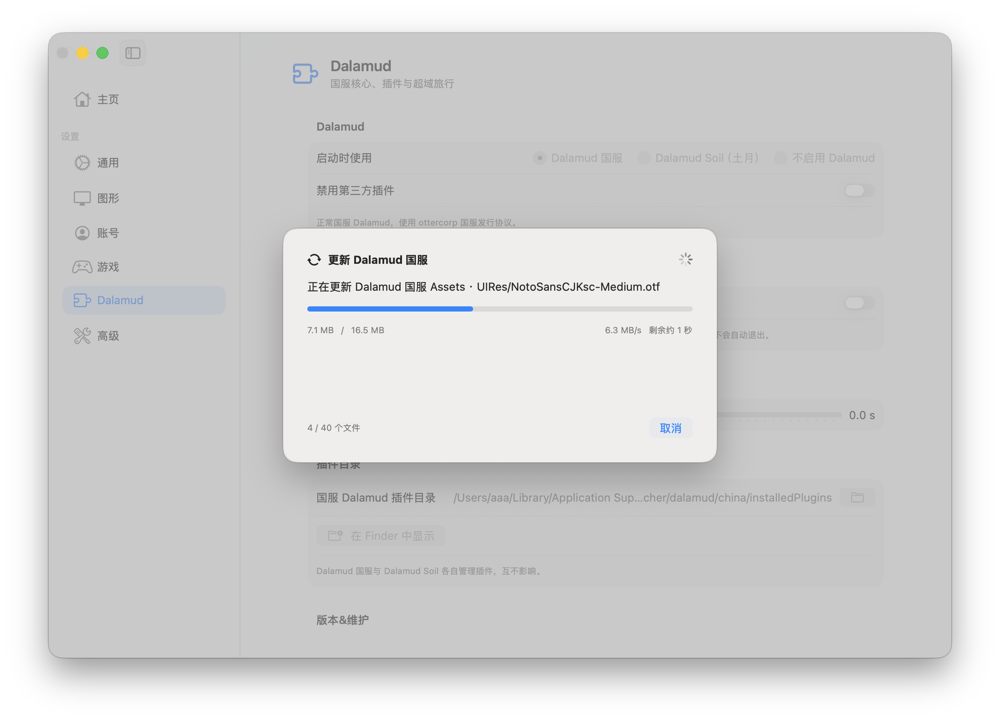

<p align="center">
  
</p>

<h1 align="center">FF14 国服 Mac 启动器</h1>

<p align="center">
  Apple Silicon · macOS 26+ · SwiftUI · DXMT-only
</p>

<p align="center">
  <a href="https://github.com/shmckfd7dc-stack/XIVCN-Mac-Launcher/actions"></a>
  <a href="https://github.com/shmckfd7dc-stack/XIVCN-Mac-Launcher/releases"></a>
  <a href="https://github.com/shmckfd7dc-stack/XIVCN-Mac-Launcher/blob/main/NOTICE"></a>
</p>

`FF14 国服 Mac 启动器` 是一款面向 Apple Silicon Mac 的最终幻想 XIV 国服启动器。项目将账号登录、文件管理、在线下载&更新、运行环境配置、游戏启动以及可选的双 Dalamud 国服/Soil（土月） 注入功能整合到一个原生 macOS 启动器中，为国服Mac玩家提供完整的游戏启动与维护流程。 

当前发布基线为 `XIVCN Mac Launcher 1.0.0`。


## 设计概览

项目采用简洁、现代的 macOS 原生界面。主页面用于展示账号信息、游戏来源、当前运行状态以及启动入口；设置页面按照通用、图形、账号、游戏、Dalamud 和高级功能进行分类，方便快速找到和管理各项功能。

项目的主要运行流程采用统一的状态管理，包括游戏和 Dalamud 的版本检查、下载、校验、激活、注入以及退出等操作。国服 Dalamud 与 土月 Soil 使用独立的运行目录，用户选择对应版本后即可使用相应的运行环境。MetalFX、Retina、MSync、键盘映射等功能则通过启动器设置参与游戏启动流程。


## UI 设计

- 使用原生 SwiftUI 构建，整体遵循 macOS 的窗口、侧栏、Material 材质和控件交互方式。
- 支持跟随系统自动切换浅色和深色模式，也可以在启动器内单独选择外观模式。
- 主页面集中展示账号、游戏来源、运行状态和启动操作；设置页面按照功能进行分类。
- 下载、更新、完整性检查、注入和重置等操作均提供对应的状态和进度反馈，并使用适度的动画提升操作过程的连贯性。


## 界面预览

<p align="center">
  
  
</p>

<p align="center">
  
  
</p>

<p align="center">
  
  
</p>

<p align="center">
  
  
</p>

<p align="center">
  
  
</p>

界面支持跟随系统自动切换浅色与深色模式，也可以在启动器内单独选择外观模式。预览图仅用于展示界面布局和交互结构，不包含账号信息或本地文件路径。


## 功能

- 支持快速续登、账号密码、扫码、验证码和 WeGame 登录
- 支持国服游戏来源选择、版本检查、更新和用户主动发起的完整性修复
- 支持直接启动游戏，或选择 Dalamud 国服 / Soil（土月）后启动
- 支持 Dalamud 下载、版本更新、插件目录管理、清理以及不同变体的运行环境隔离
- 使用 XOM 5.4.2 Wine、DXMT 运行环境，并支持运组件同步上游更新
- 支持 MetalFX（实验性）、Retina、MSync、键盘映射和超域旅行等功能
- 使用原生 SwiftUI 构建 macOS 界面，Core Bridge 通过 Rosetta 提供登录和游戏启动能力。


## 运行要求

- Apple Silicon Mac
- macOS 26 或更高版本
- Rosetta 2
- 通过 DMG 安装后，Wine、DXMT 及其他必要的运行时资源均由 App 自带


## 构建与测试

源码仓库主要包含项目源码、测试、构建脚本及必要的项目文档。固定版本的 .NET SDK、XOM/DXMT 构建资源以及离线复现所需材料统一放在配套的维护交接包中。

在完整维护环境的项目目录执行：

```sh
sh scripts/validate-cn-config.sh
sh work/validate-runtime.sh
sh scripts/test-core.sh
```

构建最终 App/DMG：

```sh
XIVCN_LAUNCHER_VERSION=1.0.0 sh scripts/build-dmg.sh
```

当前核心回归测试为 44 项。正式发布应同时检查签名、Runtime 来源哈希和 DMG 内的应用名称与版本号。


## 项目结构

```text
Sources/XIVLauncherCNMac/  SwiftUI App 与生产逻辑
Tests/                     核心回归测试
work/core-bridge/          JSON Core Bridge 源码
scripts/                   构建、测试和来源验证脚本
Assets/                    App 图标源文件
docs/licenses/             运行时与上游许可说明
```

## 维护原则

- 以 `XIVCN Mac Launcher 1.0.0` 为当前基线，修改功能前优先补充或确认相关测试。
- 优先复用现有 Core Bridge、更新器和状态流，不重复实现另一套后端。
- 日常检查保持轻量，完整扫描仅在用户主动执行时进行。
- 不将账号信息、Keychain 内容、用户本地路径或运行日志提交到源码仓库。
- Wine、DXMT、Core 组件及发行源发生变更时，应记录对应的来源、版本和哈希，并进行实际运行验证。


## 发布

正式版本通过 GitHub Release 发布。
Release 包含最终 DMG；源码仓库不包含本地维护交接材料及离线复现资源。


## 注意事项

- 本启动器已在国服版本 `2026.8.5` 上完成实际测试，游戏启动和 Dalamud 注入均正常。
- 游戏在线下载功能尚未完成实际测试。目前使用的是本地已有的游戏文件进行验证。后续维护时应单独测试在线下载、取消、下载失败以及重新启动等流程。
- MetalFX 动态超分目前属于实验性功能。MetalHUD 对动态超分状态的读取和显示存在 Bug，但实际动态超分功能已确认正常生效，判断功能是否生效应以实际游戏表现和 FPS 变化为准。
- 游戏内 DLSS 选项显示为灰色且无法选择属于正常现象。FF14 实际使用的是转译层提供的动态超分机制，该选项状态不代表动态超分功能失效。
- 如果动态超分未正常激活，可以进入游戏后，先在设置中先选择“低于 60 FPS 时启用”并保存，再切换为“一直启用”并保存，后移动角色或晃动视角，观察 FPS 是否出现明显变化。
- 仅支持 Apple Silicon Mac 和 macOS 26 及以上版本，不支持 Intel Mac。


## 项目来源与参考

项目只列出实际参与构建、运行时来源或代码/协议参考的项目：

- [XIVLauncherCN](https://github.com/ottercorp/FFXIVQuickLauncher)：登录、游戏启动和国服运行组件参考。
- [file.bluefissure.com/FFXIV/Dalamud/xlcore/macos](https://file.bluefissure.com/FFXIV/Dalamud/xlcore/macos)：Mac启动器逻辑参考。
- [XIVLauncherCN 6.8.0-2](https://github.com/ottercorp/FFXIVQuickLauncher/releases/tag/6.8.0-2)：国服 Dalamud 注入与发行流程参考。
- [AtmoOmen/FFXIVQuickLauncher](https://github.com/AtmoOmen/FFXIVQuickLauncher)：Dalamud Soil（土月）变体的运行与发行参考。
- [Dalamud](https://github.com/goatcorp/Dalamud)：插件运行时架构和协议参考；国服发行资源使用项目配置的发行源。
- [XIV on Mac](https://github.com/marzent/XIV-on-Mac)：macOS Wine、Metal、HiDPI 和 XOM 运行时参考；当前版本使用固定版本的 XOM Wine/DXMT。
- [DXMT](https://github.com/3Shain/dxmt)：Direct3D 11/DXGI 到 Metal 的转换组件仅供参考，当前版本使用 DXMT-only 路径及上游 XOM的版本。
- 国服相关登录、Dalamud 和发行源行为参考了 `UPSTREAMS.json` 中列出的 China launcher 项目；这些项目不属于本仓库的原创代码。


## 许可

本项目及其依赖的来源和许可证见 [`NOTICE`](NOTICE)、[`docs/licenses`](docs/licenses) 以及各上游源码目录中的许可证文件。
